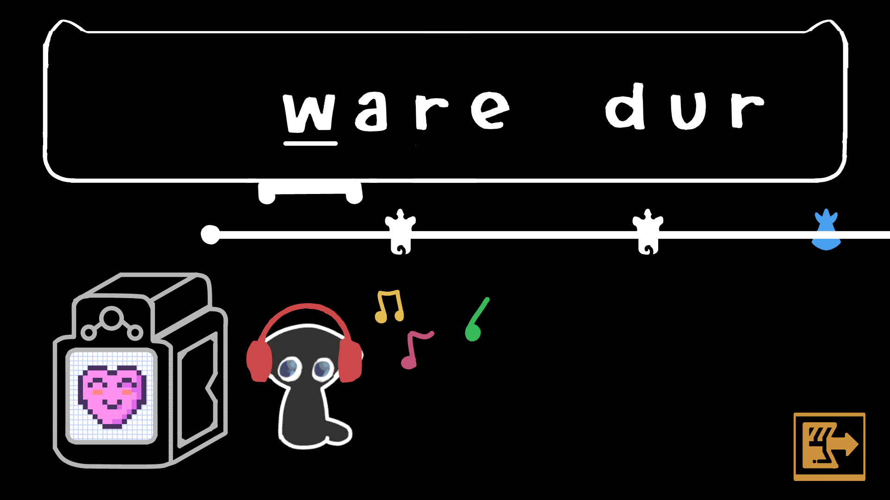

# noki

Noki's mission is to create an algorithm that injects as much musicality and proven design patterns into ANY "list of words" and ANY song/sound as possible -- mixing grid alignment with a controlled random/humanized feel to create a playable custom rhythmic level that takes "typing" up another key (musically and keyboard-ly).

Noki uses deterministic techniques, music theory, and audio analysis. As developers, we take heavy inspiration from modern rhythm games' systems, trends, and (albeit handmade) levels and want to imitate their impact with generated beatmaps from top to bottom. 

LIMITATION: may require iteration and playtesting to truly reach the level of hand-crafted levels. 

### ==== FEATURES ==== ###

- Allows user customizability in designing levels/music (custom word bank per level, custom music)
- Algorithm that maps words to bpm in a ergonomically satisfying way
- 3-5 default progression levels, each level with a specific word bank (music finished) to demonstrate 
- Journey, Classic, Master modes. Visualizer: (counted as checkmark on level (Journey accomplished), star (Classic accomplished), and cat crown (Master mode accomplished))

# FAR FUTURE
 add features to:
 1. add X words to word bank by finding similar words in DIFFICULTY and CHARS_USED
 2. add X words to word bank by finding similar words in DIFFICULTY but covering the less covered chars
 3. cut X words from word bank that are cover chars that are too similar 

# ART
style: constant brush thickness (no pressure sensor), simplistic with smooth animation 
- art ref: check out friday night funkin

- cat shaking head animation (loop)

THREE cat emote animations for CORRECT notes (happy) 
      -> VERY QUICK -> should return back to cat shaking head

 THREE cat emote animations for INCORRECT notes (sad)
      -> VERY QUICK -> should return back to cat shaking head

 speakers booming animation (loop)
 floating music notes coming out of speakers

# 6 BACKGROUNDS, one for each song (very simple ones!)

# MUSIC (undecided)

LEVELS:
- tutorial (bpm=120, song_secs:) yes_ending
- heartme2 (bpm = 120, ) yes_ending
- moonlitforest (bpm = 110) yes_ending
- finalmeow (bpm=180, ) yes_ending
- RAMJAM (bpm=120) yes_ending
- BAMSAM (bpm=170) yes_ending
- thatstrange.. (bpm=150) 
- goofuhdur (bpm=120, )

PASSIVE:
- heyjazz (title screen) bpm=95 no_ending
- heyjazz (level-play screen) bpm=95 no_ending
- heyjazz (settings screen) bpm=95 no_ending